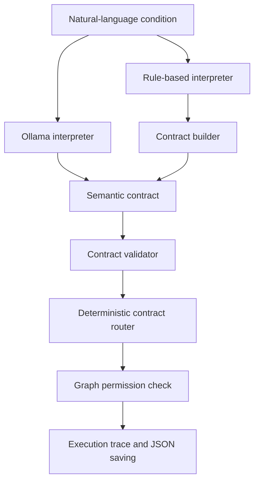

# Week 4 - Architecture Diagram

```mermaid
flowchart TD
    NL["Natural-language condition"] --> LLM["Ollama interpreter"]
    LLM --> CONTRACT["Semantic contract"] --> VALIDATOR["Contract validator"]
    VALIDATOR --> ROUTER["Deterministic contract router"]
    ROUTER --> GRAPH["Graph permission check"]
    GRAPH --> TRACE["Execution trace and JSON saving"]
    NL --> RULE["Rule-based interpreter"] --> BUILDER["Contract builder"] --> CONTRACT
```
